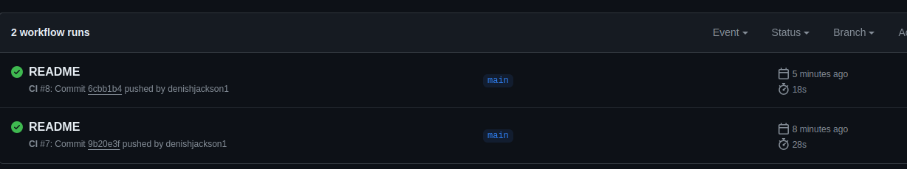
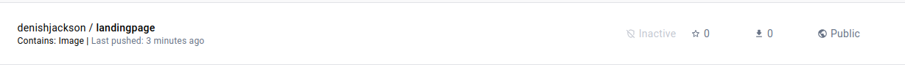

# Automating Build and Push to DockerHub with GitHub Actions
This repository contains an application ready to be Dockerized and pushed to Docker Hub using GitHub Actions.

### Application Setup
**Create Dockerfile:**

    Create a Dockerfile in the root directory of your application. The Dockerfile contains instructions for building the Docker image for your application. For this application, we shall use Nginx

        ```bash
        # Use an official Node.js runtime as the base image
        FROM node:14

        # Set the working directory in the container
        WORKDIR /usr/src/app
        ```
    Customize the Dockerfile according to your application's requirements.

### Workflow Setup
**Create GitHub Actions Workflow:**

    Create a new workflow file, such as .github/workflows/{nameofworkflow}.yml, in your repository with the following content:

        ```bash
        name: Build and Push Docker Image

        on:
        push:
            branches:
            - main

        jobs:
        build:
            runs-on: ubuntu-latest

            steps:
            - name: Checkout Repository
                uses: actions/checkout@v2

            - name: Build Docker Image
                run: docker build . --file Dockerfile -t ${{ secrets.DOCKERHUB_USERNAME }}/your-image-name:latest

            - name: Log in to Docker Hub
                run: echo "${{ secrets.DOCKERHUB_TOKEN }}" | docker login -u ${{ secrets.DOCKERHUB_USERNAME }} --password-stdin

            - name: Push to Docker Hub
                run: docker push ${{ secrets.DOCKERHUB_USERNAME }}/your-image-name:latest
        ```        
### Add Docker Hub Secrets:

    - Go to your GitHub repository.

    - Click on `"Settings"` and then `"Secrets and Variables"`.

    - Click on `Actions` and `New Repository Secrets` to add two secrets: `DOCKERHUB_USERNAME` (your Docker Hub username) and `DOCKERHUB_TOKEN` (your Docker Hub access    token or password).

### Customize Workflow:

    Replace `your-image-name` with the actual name of your Docker image.

    Ensure that your Dockerfile is correctly configured and located in the root directory of your repository.

### Commit and Push:

    Commit the changes and push them to your repository. The workflow will automatically trigger on pushes to the main branch.

Confirm the Pipeline is Successful and image has been push to DockerHub Registry.

**GitHub Action Status**



**DockerHub Image**
